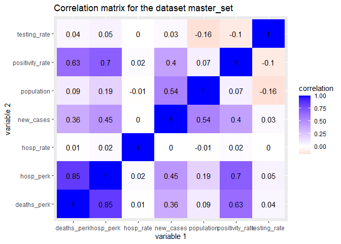
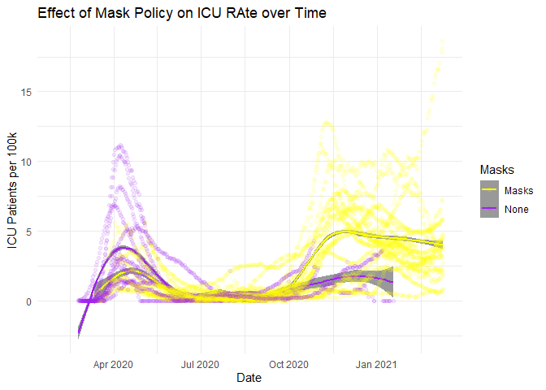
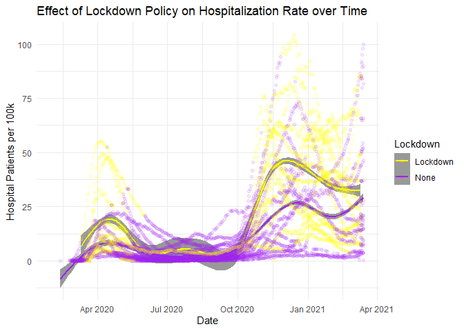
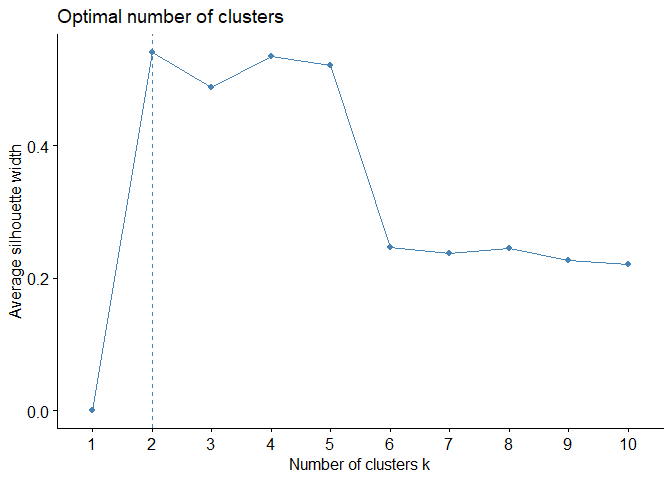
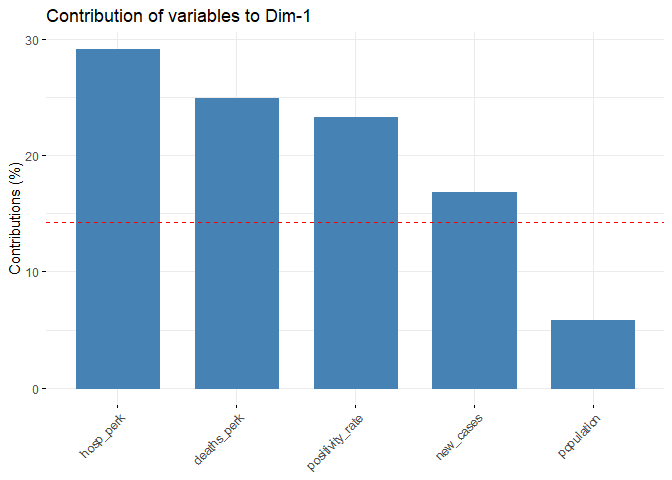
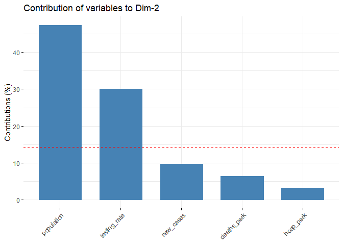
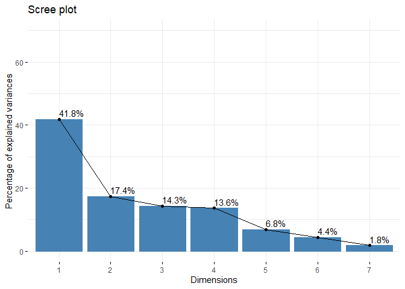
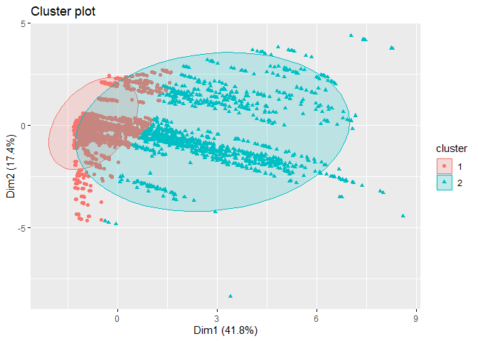

COVID-19 Exploratory Analysis
================
Joseph Reitman
3/21/2021

## Introduction

The COVID-19 pandemic drastically altered the lives of citizens around
the world. Numerous countries saw their healthcare systems overrun with
patients as the disease has spread around the globe. From the beginning
of the pandemic, countries have taken various approaches in an attempt
to mitigate the effects of the pandemic.

This analysis seeks to investigate the use of three mitigation
strategies: testing, masks, and lockdowns. Testing, when considered as a
mitigation strategy, seeks to control the spread of the disease by
identifying and quarantining those who have it. Mask mandates seek to
prevent the transmission of the virus between persons in publics
settings through the use of protective facemass, Lockdowns are
considered the most drastic measure of control the spread of disease,
where movement is restricted and businesses are closed in an attempt to
stop interactions between people. However, due to the extreme
consequences of such measures, they are genrally considered to be a last
resort in a pandemic.

This analysis looks at datasets provided by the European Centre for
Disease Prevention and Control. Their website provides four datasets of
interest. All datasets contain the European Countries and measurements
of time. The “Testing” dataset provides information on testing from all
countries. It provides weekly information on the amount of tests done,
country population, testing rate by population, positivity rate, and
amount of new cases detected. It was chosen in order to provide
information on testing. The “Measures” dataset includes the start and
end dates of various measures. It is used to provide information on
active response measures during the pandemic. The “Hosptilization”
dataset gives information on the hospital and icu admission rates in the
country. It is used measure the impact of the pandemic on the healthcare
system. Finally, the “Deaths” dataset provides information on deaths due
to COVID, another measure of the impact of the pandemic on the country.
This dataset is unique in that it included world data, most of which was
excluded from analysis.

It is expected that increased in Testing and more stringent Mask Policy
and Lockdowns will all mitigate the effects of the pandemic on the
hospital system, with each member of the list having a greater effect in
reducing hospitalization and icu-admission rates.

``` r
#Prepare the workspace
#install.packages("kableExtra")

library(kableExtra)
```

    ## Warning: package 'kableExtra' was built under R version 4.0.4

``` r
library(tidyverse)
```

    ## -- Attaching packages --------------------------------------- tidyverse 1.3.0 --

    ## v ggplot2 3.3.3     v purrr   0.3.4
    ## v tibble  3.0.6     v dplyr   1.0.3
    ## v tidyr   1.1.2     v stringr 1.4.0
    ## v readr   1.4.0     v forcats 0.5.1

    ## -- Conflicts ------------------------------------------ tidyverse_conflicts() --
    ## x dplyr::filter()     masks stats::filter()
    ## x dplyr::group_rows() masks kableExtra::group_rows()
    ## x dplyr::lag()        masks stats::lag()

``` r
library(cluster)
library(factoextra)
```

    ## Warning: package 'factoextra' was built under R version 4.0.4

    ## Welcome! Want to learn more? See two factoextra-related books at https://goo.gl/ve3WBa

## Tidy

The first dataset will contain testing data. It can be accessed from
this link:
<https://www.ecdc.europa.eu/en/publications-data/covid-19-testing>

It contains the following columns: country, country\_code, year\_week,
level, region\_name, new\_case, tests\_done, population, testing\_rate,
positivity\_rate, testing\_data\_source.

The country code, region, and testing data source are unnecessary and
will be dropped from the data. Level will be filtered so that only
national data is included, so as not to double count data, and to
simplify later areas of analysis.

``` r
#Read in dataset
testing <- read.csv("Testing.csv") 

#Look at the head
head(testing)
```

    ##   ï..country country_code year_week    level region region_name new_cases
    ## 1    Austria           AT  2020-W15 national     AT     Austria      1954
    ## 2    Austria           AT  2020-W16 national     AT     Austria       773
    ## 3    Austria           AT  2020-W17 national     AT     Austria       479
    ## 4    Austria           AT  2020-W18 national     AT     Austria       349
    ## 5    Austria           AT  2020-W19 national     AT     Austria       249
    ## 6    Austria           AT  2020-W20 national     AT     Austria       367
    ##   tests_done population testing_rate positivity_rate testing_data_source
    ## 1      12339    8901064     138.6239      15.8359673  Manual webscraping
    ## 2      58488    8901064     657.0900       1.3216386  Manual webscraping
    ## 3      33443    8901064     375.7191       1.4322878  Manual webscraping
    ## 4      26598    8901064     298.8182       1.3121287     Country website
    ## 5      42153    8901064     473.5726       0.5907053     Country website
    ## 6      46001    8901064     516.8034       0.7978087     Country website

``` r
#Clean the data and save a new dataset
testing_tidy <- testing %>%
  rename(Country = 1) %>% #For some reason the first column has a weird name that was hard to type so this fixes that
  filter(level == "national") %>% #Only include national data
  select(Country, year_week, new_cases, tests_done, population, testing_rate, positivity_rate) #Select the columns I want now

#Head of new dataset
head(testing_tidy)
```

    ##   Country year_week new_cases tests_done population testing_rate
    ## 1 Austria  2020-W15      1954      12339    8901064     138.6239
    ## 2 Austria  2020-W16       773      58488    8901064     657.0900
    ## 3 Austria  2020-W17       479      33443    8901064     375.7191
    ## 4 Austria  2020-W18       349      26598    8901064     298.8182
    ## 5 Austria  2020-W19       249      42153    8901064     473.5726
    ## 6 Austria  2020-W20       367      46001    8901064     516.8034
    ##   positivity_rate
    ## 1      15.8359673
    ## 2       1.3216386
    ## 3       1.4322878
    ## 4       1.3121287
    ## 5       0.5907053
    ## 6       0.7978087

The next dataset covers hospitalizations. It can be accessed from this
link:
<https://www.ecdc.europa.eu/en/publications-data/download-data-hospital-and-icu-admission-rates-and-current-occupancy-covid-19>

It countains the columns: country, indicator, date, year\_week, value,
source, url. As mentioned before, source and url are unnecessary and
will be dropped from the data. The indicator column actually contains
the names of several variables, so pivot\_wider is used to tidy the data
and give each variable its own column. This adds variables measuring
daily hospital and icu occupancy as well as weekly admissions.
Collapsing the data to only include weekly hospital and icu occupancy
was considered, however, due to the nature of this dataset and others,
this created several problems in the analysis and so the idea was
abandoned.

``` r
#Read the file
hospitalizations <- read.csv("hospitalizations.csv")

#Look at the head
head(hospitalizations)
```

    ##   ï..country                indicator     date year_week value          source
    ## 1    Austria Daily hospital occupancy 4/1/2020  2020-W14   856 Country_Website
    ## 2    Austria Daily hospital occupancy 4/2/2020  2020-W14   823 Country_Website
    ## 3    Austria Daily hospital occupancy 4/3/2020  2020-W14   829 Country_Website
    ## 4    Austria Daily hospital occupancy 4/4/2020  2020-W14   826 Country_Website
    ## 5    Austria Daily hospital occupancy 4/5/2020  2020-W14   712 Country_Website
    ## 6    Austria Daily hospital occupancy 4/6/2020  2020-W15   824 Country_Website
    ##                                                     url
    ## 1 https://covid19-dashboard.ages.at/dashboard_Hosp.html
    ## 2 https://covid19-dashboard.ages.at/dashboard_Hosp.html
    ## 3 https://covid19-dashboard.ages.at/dashboard_Hosp.html
    ## 4 https://covid19-dashboard.ages.at/dashboard_Hosp.html
    ## 5 https://covid19-dashboard.ages.at/dashboard_Hosp.html
    ## 6 https://covid19-dashboard.ages.at/dashboard_Hosp.html

``` r
#Tidy the data
hospitalizations_tidy <- hospitalizations %>%
  rename(Country = 1) %>% #Same problem as before
  pivot_wider(names_from = indicator, values_from = value) %>% #Create the columns for the variables
  select(-source, -url) #Get rid of the unwanted columns
  

#Look at the head of the new data.
head(hospitalizations_tidy)
```

    ## # A tibble: 6 x 7
    ##   Country date  year_week `Daily hospital~ `Daily ICU occu~ `Weekly new hos~
    ##   <chr>   <chr> <chr>                <dbl>            <dbl>            <dbl>
    ## 1 Austria 4/1/~ 2020-W14               856              215               NA
    ## 2 Austria 4/2/~ 2020-W14               823              219               NA
    ## 3 Austria 4/3/~ 2020-W14               829              245               NA
    ## 4 Austria 4/4/~ 2020-W14               826              245               NA
    ## 5 Austria 4/5/~ 2020-W14               712              244               NA
    ## 6 Austria 4/6/~ 2020-W15               824              250               NA
    ## # ... with 1 more variable: `Weekly new ICU admissions per 100k` <dbl>

The next dataset covers the response measures of various countries to
COVID-19. It can be found at this link:
<https://www.ecdc.europa.eu/en/publications-data/download-data-response-measures-covid-19>

This data has 4 columns: Country, Response\_measure, date\_start,
date\_end. The dataset was filtered for observations that had to do with
mask ordinances and lockdowns. Lockdowns were defined as anything with a
stay home order or closure of nonessential business. Mask ordinances
were anything that contained masks. The data was filtered to reflect
only these events.

To facilitate easier marking of the data later in the analysis,
date\_start and date\_end were placed in an “event” column with the
dates in a “date” column using pivot\_longer. Any end date that was NA
was replaced with March 11, 2021, meaning that the measure was still
ongoing that day (the day the dataset was published.) The data will need
to go through a second round of tidying later in the analysis, to
separate Mask observations from lockdown observations, this will be
shown later.

``` r
#Load in data
measures <- read.csv("response_graphs_data_2021-03-11 P.csv")

#View the head
head(measures)
```

    ##   Country      Response_measure date_start  date_end
    ## 1 Austria AdaptationOfWorkplace  3/16/2020 4/13/2020
    ## 2 Austria        BanOnAllEvents  11/3/2020      <NA>
    ## 3 Austria           ClosDaycare  3/16/2020  5/4/2020
    ## 4 Austria    ClosDaycarePartial 11/17/2020 12/7/2020
    ## 5 Austria              ClosHigh  3/16/2020 9/30/2020
    ## 6 Austria       ClosHighPartial  11/3/2020      <NA>

``` r
tidy_measures <- measures %>%
  #Long truth statement that searches strings for ordinances of interest
  filter(grepl("Masks", Response_measure, fixed = TRUE) | grepl("NonEssentialShops", Response_measure, fixed = TRUE)| grepl("StayHomeOrder", Response_measure, fixed = TRUE)) %>%
  #For whatever reason the dates had to be converted to characters in order for the analysis to work.
  mutate(date_start = as.character(date_start), date_end = as.character(date_end)) %>%
  #Replace NAs in date_end with the date of the data collection.
  replace_na(list(date_end = "3/11/2021")) %>%
  #Create the tidy dataset
  pivot_longer(c("date_start", "date_end"), names_to = "event", values_to = "date")

#View new dataset
head(tidy_measures)
```

    ## # A tibble: 6 x 4
    ##   Country Response_measure                  event      date     
    ##   <chr>   <chr>                             <chr>      <chr>    
    ## 1 Austria MasksMandatoryAllSpaces           date_start 9/14/2020
    ## 2 Austria MasksMandatoryAllSpaces           date_end   3/11/2021
    ## 3 Austria MasksMandatoryClosedSpaces        date_start 4/6/2020 
    ## 4 Austria MasksMandatoryClosedSpaces        date_end   6/14/2020
    ## 5 Austria MasksMandatoryClosedSpacesPartial date_start 6/15/2020
    ## 6 Austria MasksMandatoryClosedSpacesPartial date_end   9/13/2020

The final dataset is used to look at deaths due to covid. It can be
accessed here:
<https://www.ecdc.europa.eu/en/publications-data/download-todays-data-geographic-distribution-covid-19-cases-worldwide>

It ends on December 14, 2021. It contains the following relevant
columns: dateRep, deaths, countries and territories. Cleaning this data
simply involved selecting the desired columns.

``` r
#Read in data
covid_deaths <- read.csv("COVID-19-geographic-disbtribution-worldwide-2020-12-14.csv")

#View dataset head
head(covid_deaths)
```

    ##      dateRep day month year cases deaths countriesAndTerritories geoId
    ## 1 12/14/2020  14    12 2020   746      6             Afghanistan    AF
    ## 2 12/13/2020  13    12 2020   298      9             Afghanistan    AF
    ## 3 12/12/2020  12    12 2020   113     11             Afghanistan    AF
    ## 4 12/11/2020  11    12 2020    63     10             Afghanistan    AF
    ## 5 12/10/2020  10    12 2020   202     16             Afghanistan    AF
    ## 6  12/9/2020   9    12 2020   135     13             Afghanistan    AF
    ##   countryterritoryCode popData2019 continentExp
    ## 1                  AFG    38041757         Asia
    ## 2                  AFG    38041757         Asia
    ## 3                  AFG    38041757         Asia
    ## 4                  AFG    38041757         Asia
    ## 5                  AFG    38041757         Asia
    ## 6                  AFG    38041757         Asia
    ##   Cumulative_number_for_14_days_of_COVID.19_cases_per_100000
    ## 1                                                   9.013779
    ## 2                                                   7.052776
    ## 3                                                   6.868768
    ## 4                                                   7.134266
    ## 5                                                   6.968658
    ## 6                                                   6.963401

``` r
#Select and name appropriate columns
covid_deaths_tidy <- covid_deaths %>%
  select(dateRep, deaths, countriesAndTerritories) %>%
  rename(Country = 3)

#View cleaned dataset
head(covid_deaths_tidy)
```

    ##      dateRep deaths     Country
    ## 1 12/14/2020      6 Afghanistan
    ## 2 12/13/2020      9 Afghanistan
    ## 3 12/12/2020     11 Afghanistan
    ## 4 12/11/2020     10 Afghanistan
    ## 5 12/10/2020     16 Afghanistan
    ## 6  12/9/2020     13 Afghanistan

## Join

The datasets are joined here. There are 4 datasets to join. Left\_joins
were applied to the hospitilizations dataset to preserve the dates found
in the hospitalizations dataset but exclude the extra countries found in
the covid\_deaths dataset. A full\_join was used for measures to keep
any measures not found in the date range of the hospitilizations dataset
while also preserving the dates of measures outside of any date range so
far discussed.

51,042 observations are dropped after joining hospitalizations to
covid\_deaths, mainly due to dropping the extra countries found in the
covid\_deaths dataset.

No observations are in joining the testing dataset to the master set, as
the master set is larger than the testing set.

237 observations are added after the full join with response measure,
due to some response measure occuring before the countries began
reporting data.

Country and some measure of date were used to join the data together, as
this was sufficient to unique identify each observation.

``` r
#Join data together
master_set <- hospitalizations_tidy %>%
  left_join(covid_deaths_tidy, by = c("Country" , "date" = "dateRep"))%>%
  left_join(testing_tidy, by = c("Country", "year_week")) %>%
  full_join(tidy_measures, by = c("Country", "date"))
```

The master data set still needs to be tidied. First, all dates were
converted to proper dates, instead of characters. This facilitated
arranging the data by country and date. New columns were created that
stored Mask response measures and Lockdown measures. When a mandate
ended, as indicated by “End Date”, the column containing that mandate
had its value changed to “None”. Finally, fill() was used to complete
the missing values in these columns, which marked every day with the
appropriate mandate. Using this method created some “holes” as mandates
are generally still in effect on the day they end. However, fixing this
bug turned out to be complicated and the bug occurs relatively rarely
compared to the large size of the dataset, such that this bug is not
likely to significantly effect the final results. Therefore, these false
“None” values were left in.

``` r
master_set_tidy <- master_set %>%
  mutate(date = as.Date(date, '%m/%d/%Y')) %>% #Convert to dates
  arrange(Country, date) %>% #Arrange so that fill will work later
  mutate(Response_measure = as.character(Response_measure)) %>% #Necessary for some reason
  #Detect start dates of Mask mandates and add them to a column
  mutate(Masks = ifelse(event == "date_start" & grepl("Masks", Response_measure, fixed = TRUE), Response_measure, NA)) %>%
  mutate(Lockdown = ifelse(grepl("NonEssentialShops", Response_measure, fixed = TRUE)| grepl("StayHomeOrder", Response_measure, fixed = TRUE), Response_measure, NA)) %>% #repeat with lockdown mandates
  #Find end dates
  mutate(Masks = ifelse(event == "date_end" & grepl("Masks", Response_measure, fixed = TRUE), "None", Masks)) %>% 
  mutate(Lockdown = ifelse(event == "date_end" & (grepl("NonEssentialShops", Response_measure, fixed = TRUE)| grepl("StayHomeOrder", Response_measure, fixed = TRUE)), "None", Lockdown)) %>% #With lockdowns
  fill(Masks) %>% #Ordering earlier allows us to fill in the NA values with the proper Policies
  fill(Lockdown) #Repeat

#View head of data
head(master_set_tidy)
```

    ## # A tibble: 6 x 17
    ##   Country date       year_week `Daily hospital~ `Daily ICU occu~
    ##   <chr>   <date>     <chr>                <dbl>            <dbl>
    ## 1 Austria 2020-03-16 <NA>                    NA               NA
    ## 2 Austria 2020-03-16 <NA>                    NA               NA
    ## 3 Austria 2020-03-31 <NA>                    NA               NA
    ## 4 Austria 2020-04-01 2020-W14               856              215
    ## 5 Austria 2020-04-02 2020-W14               823              219
    ## 6 Austria 2020-04-03 2020-W14               829              245
    ## # ... with 12 more variables: `Weekly new hospital admissions per 100k` <dbl>,
    ## #   `Weekly new ICU admissions per 100k` <dbl>, deaths <int>, new_cases <int>,
    ## #   tests_done <int>, population <dbl>, testing_rate <dbl>,
    ## #   positivity_rate <dbl>, Response_measure <chr>, event <chr>, Masks <chr>,
    ## #   Lockdown <chr>

## Summarize

Before generating summary statistics, it’s necessary to create a few
columns to help in the analysis. First, Response\_measure and event are
dropped as their data is now contained elsewhere in the dataset. Then,
hospitalization rates for both time and 100k population were calculated.

``` r
master_set_summarize <- master_set_tidy %>%
  select(-Response_measure, -event) %>% #Drop unneeded columns
  #Rates between days. ifelse() is required to avoid div0 errors.
  mutate(hosp_rate = ifelse(lag(`Daily hospital occupancy`) != 0, (`Daily hospital occupancy` - lag(`Daily hospital occupancy`))/lag(`Daily hospital occupancy`), NA)) %>%
  mutate(icu_rate = ifelse(lag(`Daily ICU occupancy`) != 0, (`Daily ICU occupancy` - lag(`Daily ICU occupancy`))/lag(`Daily ICU occupancy`), NA)) %>%
  #Rates per 100k population
  mutate(hosp_perk = (`Daily hospital occupancy` * (1 * 10 ^ 5))/ population) %>%
  mutate(icu_perk = (`Daily ICU occupancy` * (1 * 10 ^ 5))/ population) %>%
  mutate(deaths_perk = (deaths * (1 * 10 ^ 5))/ population)
```

Several summary statistics were computed in order to investigate the
relationships between policy and strain on the healthcare system. Select
ones are shown in the tables below, with possible interpretations given.

``` r
master_set_summarize %>%
  group_by(Lockdown) %>%
  filter(!is.na(icu_perk)) %>%
  summarize(mean = mean(icu_perk), median = median(icu_perk), sd = sd(icu_perk)) %>%
  arrange(mean) %>%
  kbl() %>%
  kable_styling()
```

<table class="table" style="margin-left: auto; margin-right: auto;">
<thead>
<tr>
<th style="text-align:left;">
Lockdown
</th>
<th style="text-align:right;">
mean
</th>
<th style="text-align:right;">
median
</th>
<th style="text-align:right;">
sd
</th>
</tr>
</thead>
<tbody>
<tr>
<td style="text-align:left;">
None
</td>
<td style="text-align:right;">
1.260347
</td>
<td style="text-align:right;">
0.524844
</td>
<td style="text-align:right;">
1.7021528
</td>
</tr>
<tr>
<td style="text-align:left;">
RegionalStayHomeOrder
</td>
<td style="text-align:right;">
2.885732
</td>
<td style="text-align:right;">
2.622401
</td>
<td style="text-align:right;">
0.9135776
</td>
</tr>
<tr>
<td style="text-align:left;">
NonEssentialShopsPartial
</td>
<td style="text-align:right;">
3.294824
</td>
<td style="text-align:right;">
2.817941
</td>
<td style="text-align:right;">
2.6910776
</td>
</tr>
<tr>
<td style="text-align:left;">
RegionalStayHomeOrderPartial
</td>
<td style="text-align:right;">
3.970446
</td>
<td style="text-align:right;">
3.730625
</td>
<td style="text-align:right;">
1.3418481
</td>
</tr>
<tr>
<td style="text-align:left;">
StayHomeOrderPartial
</td>
<td style="text-align:right;">
4.259073
</td>
<td style="text-align:right;">
4.436687
</td>
<td style="text-align:right;">
2.0953178
</td>
</tr>
<tr>
<td style="text-align:left;">
StayHomeOrder
</td>
<td style="text-align:right;">
4.380723
</td>
<td style="text-align:right;">
3.941419
</td>
<td style="text-align:right;">
3.2513458
</td>
</tr>
<tr>
<td style="text-align:left;">
NonEssentialShops
</td>
<td style="text-align:right;">
5.075461
</td>
<td style="text-align:right;">
4.168848
</td>
<td style="text-align:right;">
3.7585943
</td>
</tr>
</tbody>
</table>

``` r
master_set_summarize %>%
  group_by(Masks) %>%
  filter(!is.na(icu_perk)) %>%
  summarize(mean = mean(icu_perk), median = median(icu_perk), sd = sd(icu_perk)) %>%
  arrange(mean) %>%
  kbl() %>%
  kable_styling()
```

<table class="table" style="margin-left: auto; margin-right: auto;">
<thead>
<tr>
<th style="text-align:left;">
Masks
</th>
<th style="text-align:right;">
mean
</th>
<th style="text-align:right;">
median
</th>
<th style="text-align:right;">
sd
</th>
</tr>
</thead>
<tbody>
<tr>
<td style="text-align:left;">
MasksVoluntaryAllSpacesPartial
</td>
<td style="text-align:right;">
0.0861116
</td>
<td style="text-align:right;">
0.0752459
</td>
<td style="text-align:right;">
0.1015361
</td>
</tr>
<tr>
<td style="text-align:left;">
MasksMandatoryClosedSpacesPartial
</td>
<td style="text-align:right;">
0.2567142
</td>
<td style="text-align:right;">
0.2068064
</td>
<td style="text-align:right;">
0.1818455
</td>
</tr>
<tr>
<td style="text-align:left;">
MasksVoluntaryClosedSpaces
</td>
<td style="text-align:right;">
0.6365694
</td>
<td style="text-align:right;">
0.4434155
</td>
<td style="text-align:right;">
0.8748359
</td>
</tr>
<tr>
<td style="text-align:left;">
MasksVoluntaryAllSpaces
</td>
<td style="text-align:right;">
1.3616966
</td>
<td style="text-align:right;">
0.8277049
</td>
<td style="text-align:right;">
1.2352223
</td>
</tr>
<tr>
<td style="text-align:left;">
MasksMandatoryClosedSpaces
</td>
<td style="text-align:right;">
1.4666309
</td>
<td style="text-align:right;">
0.7213070
</td>
<td style="text-align:right;">
1.6829794
</td>
</tr>
<tr>
<td style="text-align:left;">
None
</td>
<td style="text-align:right;">
1.7938412
</td>
<td style="text-align:right;">
0.8238725
</td>
<td style="text-align:right;">
2.4801987
</td>
</tr>
<tr>
<td style="text-align:left;">
MasksVoluntaryClosedSpacesPartial
</td>
<td style="text-align:right;">
1.9875596
</td>
<td style="text-align:right;">
2.2367273
</td>
<td style="text-align:right;">
1.1987194
</td>
</tr>
<tr>
<td style="text-align:left;">
MasksMandatoryAllSpaces
</td>
<td style="text-align:right;">
3.8885848
</td>
<td style="text-align:right;">
3.9232991
</td>
<td style="text-align:right;">
2.9319439
</td>
</tr>
<tr>
<td style="text-align:left;">
MasksMandatoryAllSpacesPartial
</td>
<td style="text-align:right;">
4.0952758
</td>
<td style="text-align:right;">
3.5799709
</td>
<td style="text-align:right;">
3.3346808
</td>
</tr>
</tbody>
</table>

ICU admission rate tends to increase with increasing lockdown
stringency. This is likely because Lockdowns were used in a reactive
manner. Rather than being used to prevent the spread of disease, they
were used to control outbreaks once they had already occured.

Mask mandates also tend to show a similar pattern, as countries were
slow to require masks until the pandemic was well underway. However,
when countries no guidance to citizens on masks, indicated by “None”,
tended to fair worse than those that at least recommended citizens wear
masks, breaking the trend, and indicating that enforcing mandates
through law may have been less important than simply conducting public
education campaigns.

These results should be interpreted with caution. The standard deviation
of these samples is very high. Statistical tests may show that there is
no significant difference between these categories.

``` r
master_set_summarize %>%
  summarise(n_distinct(Country))
```

    ## # A tibble: 1 x 1
    ##   `n_distinct(Country)`
    ##                   <int>
    ## 1                    32

32 countries are represented in the data.

``` r
master_set_summarize %>%
  filter(!is.na(new_cases) & !is.na(deaths)) %>%
  summarise(total_cases = sum(new_cases) / 7, total_deaths = sum(deaths)) %>%
  mutate(death_rate = total_deaths / total_cases * 100)
```

    ## # A tibble: 1 x 3
    ##   total_cases total_deaths death_rate
    ##         <dbl>        <int>      <dbl>
    ## 1   12521834.       280049       2.24

``` r
master_set_summarize %>%
  filter(!is.na(icu_perk)) %>%
  group_by(Country) %>%
  summarize(max_icu = max(icu_perk)) %>%
  arrange(desc(max_icu))
```

    ## # A tibble: 20 x 2
    ##    Country     max_icu
    ##    <chr>         <dbl>
    ##  1 Czechia       19.0 
    ##  2 Belgium       12.8 
    ##  3 France        10.4 
    ##  4 Spain         10.3 
    ##  5 Slovenia      10.1 
    ##  6 Portugal       8.78
    ##  7 Bulgaria       8.56
    ##  8 Netherlands    8.18
    ##  9 Luxembourg     7.99
    ## 10 Austria        7.97
    ## 11 Germany        6.91
    ## 12 Italy          6.82
    ## 13 Romania        6.72
    ## 14 Sweden         5.34
    ## 15 Estonia        5.27
    ## 16 Ireland        4.45
    ## 17 Cyprus         4.39
    ## 18 Iceland        3.84
    ## 19 Denmark        2.42
    ## 20 Finland        1.50

``` r
master_set_summarize %>%
  filter(!is.na(deaths)) %>%
  group_by(Country) %>%
  summarize(max_deaths = max(deaths)) %>%
  arrange(desc(max_deaths))
```

    ## # A tibble: 27 x 2
    ##    Country     max_deaths
    ##    <chr>            <int>
    ##  1 France            2004
    ##  2 Spain             1623
    ##  3 Italy              993
    ##  4 Poland             674
    ##  5 Germany            598
    ##  6 Belgium            322
    ##  7 Czechia            259
    ##  8 Ireland            234
    ##  9 Netherlands        234
    ## 10 Bulgaria           221
    ## # ... with 17 more rows

There 12,5221,834 cases of COVID recorded, with 280,049 deaths. This
gives a case fatality rate of 2.2%. The country with the highest ICU
occupancy per 100 thousand on one day was Czechia at 18.9. The country
with the highest amount of deaths in one day was France, with 2004
deaths.

``` r
master_set_summarize %>%
  count(Country) %>%
  arrange(n)
```

    ## # A tibble: 32 x 2
    ##    Country            n
    ##    <chr>          <int>
    ##  1 Liechtenstein     10
    ##  2 Switzerland       10
    ##  3 United Kingdom    24
    ##  4 Malta             88
    ##  5 Greece           127
    ##  6 Spain            194
    ##  7 Lithuania        202
    ##  8 Finland          228
    ##  9 Slovakia         326
    ## 10 Hungary          338
    ## # ... with 22 more rows

``` r
master_set_summarize %>%
  summarize(first = first(date))
```

    ## # A tibble: 1 x 1
    ##   first     
    ##   <date>    
    ## 1 2020-03-16

The countries that provided the least amount of data were Liechtenstein
and Switzerland, with only 10 data points. This was followed by the
United Kingdom. They provide so little datapoints that it was considered
to exclude them from analysis as this might cause other factors to skew.
However, in practice this did not affect the results in any meaningful
way.

The first date for which there is data is March 16, 2020.

``` r
master_set_num <- master_set_summarize %>%
   select(-`Weekly new hospital admissions per 100k`, -`Weekly new ICU admissions per 100k`, -`Daily hospital occupancy`, -`Daily ICU occupancy`, -tests_done, -icu_rate, -icu_perk, -deaths) %>%
  select_if(is.numeric)
 

correlation_matrix <- master_set_num %>%
  cor(use = "pairwise.complete.obs") %>%
  # Save as a data frame
  as.data.frame %>%
  # Convert row names to an explicit variable
  rownames_to_column %>%
  # Pivot so that all correlations appear in the same column
  pivot_longer(-1, names_to = "other_var", values_to = "correlation") %>%
  ggplot(aes(rowname, other_var, fill=correlation)) +
  # Heatmap with geom_tile
  geom_tile() +
  # Change the scale to make the middle appear neutral
  scale_fill_gradient2(low="red",mid="white",high="blue") +
  # Overlay values
  geom_text(aes(label = round(correlation,2)), color = "black", size = 4) +
  # Give title and labels
  labs(title = "Correlation matrix for the dataset master_set", x = "variable 1", y = "variable 2") 

correlation_matrix
```

<!-- -->

Transitioning between summarization and visualization is a correlation
matrix. Several numeric variables have been excluded due to similarity
to other variables already in the data set. The variables shown are
representative of broader overall trends in the data. Of interest,
testing rate did not correlate with any variable relevant to health
outcome. While testing does provide valuable information in the course
of a pandemic, the data above would indicate testing is not useful as a
mitigation strategy. However, case identification was largely accurate
in determining the severity of the pandemic, with positivity rates
closely correlating with hospitilizations (.7) and deaths (.85). Testing
rate was inversely correlated with population (-.16), possibly a
reflection that countries with a smaller population have less resources
to implement a robust testing program. Population was was also
correlated with hospitalizations per 100k (.19). This is possibly a
reflection of the increased spread of the virus through urban centers.

## Visualization

``` r
master_set_summarize %>%
  mutate(Masks = ifelse(grepl("None", Masks, fixed = TRUE), "None", "Masks")) %>% #group observations
  filter(!is.na(Masks) & date < "2021-03-11") %>% #endpoint was causing issues with geom_smooth
  ggplot(aes(x = date, y = icu_perk, color = Masks)) + #plot
  geom_smooth(alpha = 1) + #trendlines
  geom_jitter(alpha = .1) + #add points in a way that doesn't obscure lines
  theme_minimal() + #white background
  ggtitle("Effect of Mask Policy on ICU RAte over Time") + #labeling
  xlab("Date") +
  ylab("ICU Patients per 100k") +
  scale_colour_manual(values = c(Masks = "Yellow", None = "Purple"))
```

    ## `geom_smooth()` using method = 'gam' and formula 'y ~ s(x, bs = "cs")'

    ## Warning: Removed 2790 rows containing non-finite values (stat_smooth).

    ## Warning: Removed 2790 rows containing missing values (geom_point).

<!-- -->

Any country that had a mask policy was grouped and compared against
those that did not. Mask policy appears to have had an impact on
positivity rate in the begining of the pandemic. As the pandemic
continued, countries with mask policies saw an increase in icu
admissions for a time, however the mean quickly plateaued by November.
By October, countries without mask mandates began breaking above the
mean for countries with mask mandates.

``` r
master_set_summarize %>%
   mutate(Lockdown = ifelse(grepl("None", Lockdown, fixed = TRUE), "None", "Lockdown")) %>% #group observations
  filter(!is.na(Lockdown)) %>% #filter na values
  ggplot(aes(x = date, y = hosp_perk, color = Lockdown)) +
  geom_smooth(alpha = 1) + #plot trend lines
  geom_jitter(alpha = .1) + #plot points lightly, to allow the trendlines to be seen
  theme_minimal() + #white background
  ggtitle("Effect of Lockdown Policy on Hospitalization Rate over Time") + #labeling
  xlab("Date") +
  ylab("Hospital Patients per 100k") +
  scale_colour_manual(values = c(Lockdown = "Yellow", None = "Purple"))
```

    ## `geom_smooth()` using method = 'gam' and formula 'y ~ s(x, bs = "cs")'

    ## Warning: Removed 2962 rows containing non-finite values (stat_smooth).

    ## Warning: Removed 2962 rows containing missing values (geom_point).

<!-- -->

This data aggregated all countries that implemented lockdown policies
and compared them with countries that did not, and looked at
hospitalization rates over time. Lockdowns appear to have been used in
reactionary fashion in areas that were already experiencing heavy strain
on the healthcare system. Looking at trends in the data, it does appear
that they have been effective in controlling outbreaks after they have
been implemented.

# Clustering

``` r
#Prepare the data for PCA analysis and clustering
master_set_prepare <- master_set_num %>% #dataset from earlier
  filter(!is.na(new_cases)) %>%
  filter(!is.na(hosp_perk)) %>%
  filter(!is.na(hosp_rate)) %>%
  filter(!is.na(deaths_perk)) %>%
  scale
```

``` r
# Choose cluster number
fviz_nbclust(master_set_prepare, FUNcluster = pam, method = "s")
```

<!-- -->

``` r
# Perform PAM on the data
master_set_pam <- master_set_prepare %>% 
  pam(k=2)
```

There should be two clusters in the PAM clustering.

``` r
#PCA
master_set_pca <- master_set_prepare %>% 
  prcomp()

master_set_pca$rotation
```

    ##                          PC1         PC2          PC3        PC4           PC5
    ## new_cases        0.409735712  0.31146352 -0.031267569  0.3933379  0.6161768486
    ## population       0.242073054  0.68791262  0.019474254  0.3356472 -0.4706229928
    ## testing_rate    -0.008674522 -0.54881879 -0.149525476  0.7895912 -0.0833407877
    ## positivity_rate  0.482772931 -0.15188936  0.009980970 -0.2505760  0.4059456884
    ## hosp_rate        0.015575187 -0.09226464  0.987617997  0.1232880  0.0006389042
    ## hosp_perk        0.539530931 -0.18110414  0.001237914 -0.0635738 -0.2412667271
    ## deaths_perk      0.499035189 -0.25334322 -0.028191568 -0.1647486 -0.4109652775
    ##                         PC6         PC7
    ## new_cases       -0.44505111  0.04086954
    ## population       0.35573058  0.08431088
    ## testing_rate     0.20626331  0.05848355
    ## positivity_rate  0.69482314  0.18275908
    ## hosp_rate       -0.00752385  0.02446229
    ## hosp_perk       -0.09178776 -0.77809375
    ## deaths_perk     -0.37627106  0.59023035

``` r
master_set_pca$sdev
```

    ## [1] 1.7103367 1.1025107 0.9994698 0.9765946 0.6921123 0.5520829 0.3503238

``` r
fviz_contrib(master_set_pca, choice = "var", axes = 1, top = 5) # on PC1
```

<!-- -->

``` r
fviz_contrib(master_set_pca, choice = "var", axes = 2, top = 5) # on PC2
```

<!-- -->

``` r
# Visualize percentage variance
fviz_eig(master_set_pca, addlabels = TRUE, ylim = c(0, 70))
```

<!-- -->
There is an “elbow” at dimension 2 in the scree plot, confirming that
only two principle components are needed for the analysis. PC1 and PC2
both appear to group the data according to metrics such as
hospitalization and death rates, as well as population. Extreme values
in either principle component are likely an indicator of the severity of
the pandemic at that observation.

``` r
# Visualize the cluster groups according to the new variables PC1 and PC2
fviz_cluster(master_set_pam, biopsy[, -10], 
             geom = "point",  # show points only (not "text")
             ellipse.type = "norm"
             )
```

<!-- -->

The clusters found two groups. One is at extremes of dimension 1, and
the other is at relatively low values of both dimensions. Cluster 1, at
low dimensions, represents times during the pandemic when there were not
many cases whereas cluster 2 represents points where cases began to put
significant strain on the healthcare system.
