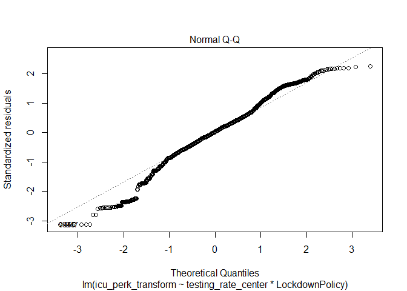

COVID-19 Modeling
================
Joseph Reitman
4/18/2021

## Introduction

The COVID-19 pandemic drastically altered the lives of citizens around
the world. Numerous countries saw their healthcare systems overrun with
patients as the disease has spread around the globe. From the beginning
of the pandemic, countries have taken various approaches in an attempt
to mitigate the effects of the pandemic.

Based upon the results of an earlier exploratory data analysis, this
analysis further invesitgates the use of three mitigation strategies:
testing, masks, and lockdowns. Testing, when considered as a mitigation
strategy, seeks to control the spread of the disease by identifying and
quarantining those who have it. Mask mandates seek to prevent the
transmission of the virus between persons in publics settings through
the use of protective facemass, Lockdowns are considered the most
drastic measure of control the spread of disease, where movement is
restricted and businesses are closed in an attempt to stop interactions
between people. However, due to the extreme consequences of such
measures, they are genrally considered to be a last resort in a
pandemic.

This analysis looks at datasets provided by the European Centre for
Disease Prevention and Control. Their website provides four datasets of
interest. All datasets contain the European Countries and measurements
of time. The “Testing” dataset provides information on testing from all
countries. It provides weekly information on the amount of tests done,
country population, testing rate by population, positivity rate, and
amount of new cases detected. It was chosen in order to provide
information on testing. The “Measures” dataset includes the start and
end dates of various measures. It is used to provide information on
active response measures during the pandemic. The “Hospitalization”
dataset gives information on the hospital and icu admission rates in the
country. It is used measure the impact of the pandemic on the healthcare
system. Finally, the “Deaths” dataset provides information on deaths due
to COVID, another measure of the impact of the pandemic on the country.
This dataset is unique in that it included world data, most of which was
excluded from analysis.

These datasets were tidied and joined in the earlier exploratory
analysis. The data was further subsetted to include only observations
before June 1st. This captures the first wave of coronavirus and is
during a time when many countries differed in response to coronavirus.
There were 11095 observations of 18 variables in the data set. Variables
include County, date, year\_week, Daily and weekly hospital and icu
occupancy, deaths, new cases, tests done, population, test rate,
positivity rate, and mask and lockdown policy.

Based on the results of the earlier exploratory analysis, it is expected
that mask policy will have better health outcomes than no mask policy,
as measured by metrics such as positivity rate and hospitlization rates.
It is also expected that testing rate and lockdowns will have little to
no effect on health outcomes, however, lockdowns will be further tested
to see if they were able to produce a delayed response and slow the
spread. It is expected that lockdowns will produce a response in
reducing the rate of spread as predicted in a logistic regression model.

## EDA

``` r
#Load in data
library(kableExtra)
```

    ## Warning: package 'kableExtra' was built under R version 4.0.4

``` r
library(tidyverse)
```

    ## -- Attaching packages --------------------------------------- tidyverse 1.3.0 --

    ## v ggplot2 3.3.3     v purrr   0.3.4
    ## v tibble  3.0.6     v dplyr   1.0.3
    ## v tidyr   1.1.2     v stringr 1.4.0
    ## v readr   1.4.0     v forcats 0.5.1

    ## -- Conflicts ------------------------------------------ tidyverse_conflicts() --
    ## x dplyr::filter()     masks stats::filter()
    ## x dplyr::group_rows() masks kableExtra::group_rows()
    ## x dplyr::lag()        masks stats::lag()

``` r
library(cluster)
library(factoextra)
```

    ## Warning: package 'factoextra' was built under R version 4.0.4

    ## Welcome! Want to learn more? See two factoextra-related books at https://goo.gl/ve3WBa

``` r
setwd("C:/Users/bessi/Documents/Computational Bio/Project2")

#Load in Data
data <- read.csv("master_set_tidy.csv") %>% 
  filter(date < "2020-06-01") 
```

Several summary statistics were computed in order to investigate the
relationships between policy and strain on the healthcare system. Select
ones are shown in the tables below, with possible interpretations given.

``` r
data %>%
  summarise(n_distinct(Country))
```

    ##   n_distinct(Country)
    ## 1                  32

32 countries are represented in the data.

``` r
data %>%
  filter(!is.na(new_cases) & !is.na(deaths)) %>%
  summarise(total_cases = sum(new_cases) / 7, total_deaths = sum(deaths)) %>%
  mutate(death_rate = total_deaths / total_cases * 100)
```

    ##   total_cases total_deaths death_rate
    ## 1    855737.6       100005   11.68641

``` r
data %>%
  filter(!is.na(icu_perk)) %>%
  group_by(Country) %>%
  summarize(max_icu = max(icu_perk)) %>%
  arrange(desc(max_icu))
```

    ## # A tibble: 18 x 2
    ##    Country     max_icu
    ##    <chr>         <dbl>
    ##  1 Belgium      11.2  
    ##  2 France       10.4  
    ##  3 Netherlands   8.18 
    ##  4 Italy         6.82 
    ##  5 Luxembourg    5.59 
    ##  6 Sweden        5.34 
    ##  7 Iceland       3.84 
    ##  8 Germany       3.52 
    ##  9 Ireland       3.12 
    ## 10 Austria       3.00 
    ## 11 Portugal      2.63 
    ## 12 Slovenia      1.72 
    ## 13 Cyprus        1.58 
    ## 14 Estonia       1.50 
    ## 15 Finland       1.50 
    ## 16 Romania       1.49 
    ## 17 Czechia       0.935
    ## 18 Denmark       0.601

``` r
data %>%
  filter(!is.na(deaths)) %>%
  group_by(Country) %>%
  summarize(max_deaths = max(deaths)) %>%
  arrange(desc(max_deaths))
```

    ## # A tibble: 25 x 2
    ##    Country     max_deaths
    ##    <chr>            <int>
    ##  1 France            2004
    ##  2 Italy              971
    ##  3 Belgium            322
    ##  4 Germany            315
    ##  5 Ireland            234
    ##  6 Netherlands        234
    ##  7 Sweden             115
    ##  8 Portugal            60
    ##  9 Finland             43
    ## 10 Romania             42
    ## # ... with 15 more rows

There were 855,737 cases of COVID recorded, with 100,005 deaths. This
gives a case fatality rate of 11.7%. The country with the highest ICU
occupancy per 100 thousand on one day was Belgium at 11.15. The country
with the highest amount of deaths in one day was France, with 2004
deaths.

``` r
data %>%
  count(Country) %>%
  arrange(n)
```

    ##           Country   n
    ## 1   Liechtenstein   3
    ## 2     Switzerland   3
    ## 3           Malta   4
    ## 4          Greece   6
    ## 5  United Kingdom   6
    ## 6       Lithuania   8
    ## 7           Spain   9
    ## 8         Denmark  22
    ## 9        Slovakia  36
    ## 10        Hungary  47
    ## 11        Croatia  49
    ## 12         Poland  51
    ## 13       Bulgaria  59
    ## 14        Austria  64
    ## 15         Latvia  64
    ## 16        Finland  69
    ## 17        Romania  71
    ## 18        Germany  75
    ## 19        Belgium  81
    ## 20       Slovenia  83
    ## 21         Norway  85
    ## 22         Cyprus  87
    ## 23        Czechia  92
    ## 24       Portugal  92
    ## 25        Iceland  94
    ## 26    Netherlands  95
    ## 27         Sweden  95
    ## 28          Italy  99
    ## 29     Luxembourg 104
    ## 30         France 112
    ## 31        Estonia 151
    ## 32        Ireland 152

``` r
data %>%
  summarize(first = first(date))
```

    ##        first
    ## 1 2020-03-16

The countries that provided the least amount of data were Liechtenstein
and Switzerland, with only 3 data points. The first date for which there
is data is March 16, 2020.

Several graphs are presented below as a starting point for the
statistical testing to follow. First presented is the relationship
between testing rate and positivity rate. If testing is a valid
mitigation strategy, there should be a negative correlation.

    ## [1] 0.3302568

<!-- -->

Raising both variables to the .2 power improves normality and linearity.
The correlation between testing rate and icu rate is .33.

Next is the relationship between mask policy and positivity rate. There
should be a lower mean for the mask policy group and a higher mean for
the group with no masks.

``` r
#Create Mask Policy Categories
data <- data %>%
  filter(!is.na(Masks)) %>%
  mutate(MaskPolicy = ifelse(grepl("None", Masks, fixed = TRUE), "None", "Mandatory")) %>%
  mutate(MaskPolicy = ifelse(grepl("Voluntary", Masks, fixed = TRUE), "Voluntary", MaskPolicy)) 

# Represent the means per policy
data %>%
  select(MaskPolicy, positivity_rate, deaths_perk, icu_perk, hosp_perk) %>% #Get data
  pivot_longer(-1,names_to='DV', values_to='measure') %>% 
  ggplot(aes(MaskPolicy,measure,fill=MaskPolicy)) +
  geom_bar(stat="summary", fun = "mean") +
  geom_errorbar(stat="summary", fun.data = "mean_se", width=.5) +
  facet_wrap(~DV, nrow=2) +
  coord_flip() + 
  ylab("") + 
  theme(legend.position = "none")
```

    ## Warning: Removed 1408 rows containing non-finite values (stat_summary).

    ## Warning: Removed 1408 rows containing non-finite values (stat_summary).

<!-- -->

``` r
data %>%
  filter(!is.na(deaths)) %>%
  group_by(MaskPolicy) %>%
  summarize(Total = sum(deaths))
```

    ## # A tibble: 3 x 2
    ##   MaskPolicy Total
    ## * <chr>      <int>
    ## 1 Mandatory  11499
    ## 2 None       80524
    ## 3 Voluntary   8185

``` r
80524 - 80524 / 3 
```

    ## [1] 53682.67

Mask policies appear to have impacted the positivity rate. The
difference between voluntary and mandatory mask mandates is much smaller
than the difference between any mask mandate and no mask mandate.

``` r
# Create lockdown policy markers
data <- data %>%
  filter(!is.na(Lockdown)) %>%
  mutate(LockdownPolicy = ifelse(grepl("None", Lockdown, fixed = TRUE), "None", "Lockdown")) 

#Represent difference in distributions
ggplot(data, aes(x = LockdownPolicy, y = positivity_rate ^ .2)) + geom_boxplot()
```

    ## Warning: Removed 171 rows containing non-finite values (stat_boxplot).

<!-- -->

Lockdowns appear to have a higher positivity rate than no lockdowns.
Later analysis will seek to determine if lockdowns were able to slow the
rate of spread throughout a population.

## MANOVA

A MANOVA test will be run to determine if there is a significant
difference between countries with different mask policies in terms of
death rates and positivity rates.

``` r
#Pull out relevant data for mask policies and response rates
data_masks <- data %>%
  select(positivity_rate, deaths_perk, hosp_perk, MaskPolicy) %>%
  filter(!is.na(positivity_rate) & !is.na(deaths_perk) & !is.na(hosp_perk)) %>%
  mutate(positivity_rate_transform = positivity_rate ^ .2) %>%
  mutate(deaths_perk_transform = deaths_perk ^ .2) %>%
  group_by(MaskPolicy)
 
#Get summary statistics
data_masks %>%
  summarize("Mean Positivity Rate" = mean(positivity_rate),  "Mean Deaths Per 100k" = mean(deaths_perk))
```

    ## # A tibble: 3 x 3
    ##   MaskPolicy `Mean Positivity Rate` `Mean Deaths Per 100k`
    ## * <chr>                       <dbl>                  <dbl>
    ## 1 Mandatory                    1.72                 0.0988
    ## 2 None                         9.61                 0.329 
    ## 3 Voluntary                    2.07                 0.143

``` r
data_masks %>%
  summarize("Mean Positivity Rate ^.2" = mean(positivity_rate_transform), "Mean Deaths Per 100k ^.2" = mean(deaths_perk_transform) )
```

    ## # A tibble: 3 x 3
    ##   MaskPolicy `Mean Positivity Rate ^.2` `Mean Deaths Per 100k ^.2`
    ## * <chr>                           <dbl>                      <dbl>
    ## 1 Mandatory                        1.00                      0.437
    ## 2 None                             1.43                      0.534
    ## 3 Voluntary                        1.09                      0.419

As previously discussed, it appears that mask policies have lower mean
positivity and death rates than areas that don’t.

``` r
# Inspect multivariate plots of response variable for each species
ggplot(data_masks, aes(x = deaths_perk_transform, y = positivity_rate_transform)) +
  geom_point(alpha = .5) + 
  geom_density_2d(h=50) + 
  coord_fixed() + 
  facet_wrap(~MaskPolicy)
```

<!-- -->

``` r
# Inspect homogeneity of (co)variances
covmats <- data_masks %>%
  select(MaskPolicy, positivity_rate_transform, deaths_perk_transform) %>%
  group_by(MaskPolicy) %>%
  do(covs=cov(.[2:3]))
# Covariance matrices per species
for(i in 1:3){print(as.character(covmats$MaskPolicy[i])); print(covmats$covs[i])}
```

    ## [1] "Mandatory"
    ## [[1]]
    ##                           positivity_rate_transform deaths_perk_transform
    ## positivity_rate_transform                0.06024035            0.03700374
    ## deaths_perk_transform                    0.03700374            0.09213514
    ## 
    ## [1] "None"
    ## [[1]]
    ##                           positivity_rate_transform deaths_perk_transform
    ## positivity_rate_transform                0.12321751            0.06306578
    ## deaths_perk_transform                    0.06306578            0.15561642
    ## 
    ## [1] "Voluntary"
    ## [[1]]
    ##                           positivity_rate_transform deaths_perk_transform
    ## positivity_rate_transform               0.034953721           0.005319392
    ## deaths_perk_transform                   0.005319392           0.134862750

The data appears to meet most of the assumptions for MANOVA (Normality,
Homogeneity of within-groups variances. There are some outliers where
deaths per 100k was 0.

``` r
# Perform MANOVA with 2 response variables listed in cbind()
manova_mask <- manova(cbind(deaths_perk_transform, positivity_rate_transform) ~ MaskPolicy, data = data_masks)

# OUtput of MANOVA
summary(manova_mask)
```

    ##              Df  Pillai approx F num Df den Df    Pr(>F)    
    ## MaskPolicy    2 0.32969    158.2      4   3206 < 2.2e-16 ***
    ## Residuals  1603                                             
    ## ---
    ## Signif. codes:  0 '***' 0.001 '**' 0.01 '*' 0.05 '.' 0.1 ' ' 1

MANOVA Test:

Null hypothesis: There is no difference between the group means in any
response variable.

Alternative hypothesis: At least one group mean significantly differs
from the others in at least one response variable.

The bonferoni correction will be discussed later, however it will not
matter in this case as the data is significant to the p &lt; .001 level.

The null hypothesis is rejected. At least one group mean significantly
differs from others in at least one response vairable.(F = 164.93, p
&lt; .001, df = 2)

``` r
 # If MANOVA is significant then we can perform one-way ANOVA for each variable
summary.aov(manova_mask)
```

    ##  Response deaths_perk_transform :
    ##               Df Sum Sq Mean Sq F value    Pr(>F)    
    ## MaskPolicy     2   4.10 2.05022  15.649 1.858e-07 ***
    ## Residuals   1603 210.01 0.13101                      
    ## ---
    ## Signif. codes:  0 '***' 0.001 '**' 0.01 '*' 0.05 '.' 0.1 ' ' 1
    ## 
    ##  Response positivity_rate_transform :
    ##               Df Sum Sq Mean Sq F value    Pr(>F)    
    ## MaskPolicy     2  67.74  33.870  366.93 < 2.2e-16 ***
    ## Residuals   1603 147.97   0.092                      
    ## ---
    ## Signif. codes:  0 '***' 0.001 '**' 0.01 '*' 0.05 '.' 0.1 ' ' 1

ANOVA Tests:

Null hypothesis: The group means do not differ

Alternative hypothesis: At least one group mean differs from the other
group means

In both cases the data is significant to the p &lt; .001. A bonferoni
correction will be discussed later, but it will not matter in this case.

For mask policy and deaths per 100k, at least one group mean
significantly differs from the other group means. (F = 18.5, p &lt;
.001, df = 2)

For mask policy and positivity rate, at least one group mean
significantly differs from the other group means. (F = 380.07, p &lt;
.001, df= 2)

``` r
    # If ANOVA is significant then we can perform post-hoc analysis
    # For deaths_perk
    pairwise.t.test(data_masks$deaths_perk_transform, data_masks$MaskPolicy, p.adj="none")
```

    ## 
    ##  Pairwise comparisons using t tests with pooled SD 
    ## 
    ## data:  data_masks$deaths_perk_transform and data_masks$MaskPolicy 
    ## 
    ##           Mandatory None   
    ## None      6.4e-07   -      
    ## Voluntary 0.58367   0.00027
    ## 
    ## P value adjustment method: none

``` r
    # For positivity_rate
    pairwise.t.test(data_masks$positivity_rate_transform, data_masks$MaskPolicy, p.adj="none")
```

    ## 
    ##  Pairwise comparisons using t tests with pooled SD 
    ## 
    ## data:  data_masks$positivity_rate_transform and data_masks$MaskPolicy 
    ## 
    ##           Mandatory None  
    ## None      <2e-16    -     
    ## Voluntary 0.0023    <2e-16
    ## 
    ## P value adjustment method: none

Significance in t-testing will be discussed following discussion of
Bonferoni correction

``` r
1 - (1 - 1/20)^9
```

    ## [1] 0.3697506

``` r
.05 / 9
```

    ## [1] 0.005555556

9 Hypothesis tests have been done. The probability of a type-I error is
.369. In order to keep the overall probability of a type I error at .05,
the significance threshold for a test should be .055.

There is a significant difference in mean death rate between both mask
policies and no mask policy (p &lt; .001), but there is not a
significant difference between voluntary and mandatory masking for mean
death rate.

There are significant differences between all policies in mean
positivity rate (p &lt; .001 for all cases).

## Randomization Test

A randomization test was performed to attempt to increase power to
detect a difference between voluntary and mandatory mask mandates on
death rates (deaths per 100k).

Null Hypothesis: There is not a significant difference in death rate
between voluntary and mandatory mask mandates

Alternative Hypothesis: There is a significant difference in death rate
between voluntary and mandatory mask mandates

``` r
data_masks_randomize <- data_masks %>%
  filter(MaskPolicy != "None")

# Calculate the mean difference between the two conditions
true_diff <- data_masks_randomize %>%
  group_by(MaskPolicy) %>%
  summarize(means = mean(deaths_perk_transform)) %>%
  summarize(mean_diff = diff(means)) %>%
  pull
true_diff
```

    ## [1] -0.01796589

``` r
# Create an empty vector to store the mean differences 
mean_diff <- vector()


# Create many randomizations with a for loop
for(i in 1:5000){ 
  temp <- data.frame(Policy = data_masks_randomize$MaskPolicy, deaths = sample(data_masks_randomize$deaths_perk_transform)) 
  
  mean_diff[i] <- temp %>% 
    group_by(Policy) %>%
    summarize(means = mean(deaths)) %>%
    summarize(mean_diff = diff(means)) %>%
    pull
}

# Calculate the corresponding two-sided p-value
mean(mean_diff > -true_diff | mean_diff < true_diff)
```

    ## [1] 0.5416

``` r
#mean(mean_diff > 18.258 | mean_diff < -18.258)
```

p &gt; .05, fail to reject the null hypothesis. There is no significant
difference in death rate between voluntary and mandatory mask policies
(p \~= .52).

Visualization:

Below is the distribution of mean differences from the randomization
test. The red line represents the true difference in means between the
groups.

``` r
# Represent the distribution of the mean differences with a vertical line showing the true difference
{hist(mean_diff, main="Distribution of the mean differences"); abline(v = -.017, col="red")}
```

<!-- -->

## Linear Regression Model

A linear regression model was created to test the effect of testing rate
and lockdown policy on icu patients per 100k, as well as to look for an
interaction.

``` r
#Pull out the variables needed for the model
linear_regression <- data %>%
  select(LockdownPolicy, icu_perk, testing_rate) %>%
  filter(!is.na(LockdownPolicy), !is.na(icu_perk), !is.na(testing_rate)) %>%
  mutate(testing_rate_transform = testing_rate ^ .25) %>% #Transform
  mutate(icu_perk_transform = icu_perk ^ .25) %>% #Transform
  mutate(testing_rate_center = testing_rate_transform - mean(testing_rate_transform)) #Mean Center


# Fit a multiple linear regression model with both predictors
fit <- lm(icu_perk_transform ~ testing_rate_center * LockdownPolicy, data = linear_regression)
summary(fit)
```

    ## 
    ## Call:
    ## lm(formula = icu_perk_transform ~ testing_rate_center * LockdownPolicy, 
    ##     data = linear_regression)
    ## 
    ## Residuals:
    ##      Min       1Q   Median       3Q      Max 
    ## -1.27205 -0.22917  0.01157  0.23528  0.91734 
    ## 
    ## Coefficients:
    ##                                        Estimate Std. Error t value Pr(>|t|)    
    ## (Intercept)                             1.14813    0.01570  73.138  < 2e-16 ***
    ## testing_rate_center                     0.05177    0.01325   3.907 9.79e-05 ***
    ## LockdownPolicyNone                     -0.28128    0.02157 -13.038  < 2e-16 ***
    ## testing_rate_center:LockdownPolicyNone  0.06894    0.01719   4.010 6.39e-05 ***
    ## ---
    ## Signif. codes:  0 '***' 0.001 '**' 0.01 '*' 0.05 '.' 0.1 ' ' 1
    ## 
    ## Residual standard error: 0.4069 on 1446 degrees of freedom
    ## Multiple R-squared:  0.1918, Adjusted R-squared:  0.1901 
    ## F-statistic: 114.4 on 3 and 1446 DF,  p-value: < 2.2e-16

``` r
#Graph the model
ggplot(linear_regression, aes(x = testing_rate_center, y = icu_perk_transform, color = LockdownPolicy)) +
  geom_point() +
  geom_smooth(method=lm, se=FALSE, fullrange=TRUE) +
  theme_minimal() +
  xlab("Testing Rate (Tests per 100k population ^ .2)") +
  ylab("ICU Patients per 100k population ^ .2")
```

    ## `geom_smooth()` using formula 'y ~ x'

<!-- --> Icu rate
and testing rate were mean transformed to the .25 power in order to
improve normality of their respective distributions. Testing rate was
further mean centered.

When a lockdown policy is in effect, the mean testing rate ^.25 is
associated with an icu rate ^.25 (icu patients per 100k people ^.25) of
1.14.

Controlling for lockdown policy, a one unit increase in testing rate ^
.25 is significantly associated with a .05 unit increase in icu rate
(icu patients per 100k people) ^ .25.

At the mean testing rate, no lockdown policy has a .28 unit lower icu
rate ^ .25 than a lockdown policy.

Controlling for lockdown policy, a one unit increase in testing rate ^
.25 is associated with a .11 unit increase in icu rate ^ .25. This is a
difference of .06 units.

Checking assumptions:

The data appears to be linear, with the exception of some outliers.

``` r
# Residuals v s Fitted values plot
plot(fit, which = 1)
```

<!-- -->

``` r
# Histogram of residuals
hist(fit$residuals)
```

<!-- -->

``` r
# Q-Q plot for the residuals
plot(fit, which = 2)
```

<!-- -->

Visually, the model appears to violate some assumptions. They will be
more rigorously checked with statistical tests.

Check for normality of residuals

``` r
# Shapiro-Wilk test
# H0: normality
shapiro.test(fit$residuals)
```

    ## 
    ##  Shapiro-Wilk normality test
    ## 
    ## data:  fit$residuals
    ## W = 0.98365, p-value = 9.411e-12

``` r
# Kolmogorov-Smirnov test
# H0: normality
ks.test(fit$residuals, "pnorm", mean=0, sd(fit$residuals))
```

    ## Warning in ks.test(fit$residuals, "pnorm", mean = 0, sd(fit$residuals)): ties
    ## should not be present for the Kolmogorov-Smirnov test

    ## 
    ##  One-sample Kolmogorov-Smirnov test
    ## 
    ## data:  fit$residuals
    ## D = 0.045737, p-value = 0.004639
    ## alternative hypothesis: two-sided

``` r
  # note: the error indicates that there are repeated values for the residuals
```

The data fails the normality of residuals assumption.

``` r
library(sandwich)
```

    ## Warning: package 'sandwich' was built under R version 4.0.5

``` r
library(lmtest)
```

    ## Warning: package 'lmtest' was built under R version 4.0.5

    ## Loading required package: zoo

    ## Warning: package 'zoo' was built under R version 4.0.5

    ## 
    ## Attaching package: 'zoo'

    ## The following objects are masked from 'package:base':
    ## 
    ##     as.Date, as.Date.numeric

``` r
# Breusch-Pagan test
# H0: homoscedasticity
bptest(fit)
```

    ## 
    ##  studentized Breusch-Pagan test
    ## 
    ## data:  fit
    ## BP = 77.113, df = 3, p-value < 2.2e-16

The data fails the homoscedasticity assumption.

Robust Standard Errors are calculated to account for violated
assumptions.

``` r
# Robust Standard Errors
#install.packages("sandwich")
library(sandwich)
coeftest(fit, vcov = vcovHC(fit))
```

    ## 
    ## t test of coefficients:
    ## 
    ##                                         Estimate Std. Error  t value  Pr(>|t|)
    ## (Intercept)                             1.148133   0.013301  86.3190 < 2.2e-16
    ## testing_rate_center                     0.051768   0.013758   3.7627 0.0001748
    ## LockdownPolicyNone                     -0.281277   0.021244 -13.2406 < 2.2e-16
    ## testing_rate_center:LockdownPolicyNone  0.068945   0.018058   3.8179 0.0001403
    ##                                           
    ## (Intercept)                            ***
    ## testing_rate_center                    ***
    ## LockdownPolicyNone                     ***
    ## testing_rate_center:LockdownPolicyNone ***
    ## ---
    ## Signif. codes:  0 '***' 0.001 '**' 0.01 '*' 0.05 '.' 0.1 ' ' 1

A robust standard error calculation returns similar results to the
original model. All results are still significant at the p &lt; .001
level.

A bootstrap analysis was also run to account for violated assumptions.

``` r
# When assumptions are violated (homoscedasticity, normality, small sample size)
# use bootstrap samples to estimate coefficients, SEs, fitted values, ...

# Example of estimating coefficients SEs
# Use the function replicate to repeat the process (similar to a for loop)
samp_SEs <- replicate(5000, {
  # Bootstrap your data (resample observations)
  boot_data <- sample_frac(linear_regression, replace = TRUE)
  # Fit regression model
  fitboot <- lm(icu_perk_transform ~ testing_rate_transform * LockdownPolicy, data = boot_data)
  # Save the coefficients
  coef(fitboot)
})

# Estimated SEs
samp_SEs %>%
  # Transpose the obtained matrices
  t %>%
  # Consider the matrix as a data frame
  as.data.frame %>%
  # Compute the standard error (standard deviation of the sampling distribution)
  summarize_all(sd)
```

    ##   (Intercept) testing_rate_transform LockdownPolicyNone
    ## 1  0.06630851             0.01369158         0.08603024
    ##   testing_rate_transform:LockdownPolicyNone
    ## 1                                0.01789822

``` r
# We can also consider a confidence interval for the estimates
samp_SEs %>%
  # Transpose the obtained matrices
  t %>%
  # Consider the matrix as a data frame
  as.data.frame %>%
  # Pivot longer to group by and summarize each coefficient
  pivot_longer(everything(), names_to = "estimates", values_to = "value") %>%
  group_by(estimates) %>%
  summarize(lower = quantile(value,.025), upper = quantile(value,.975))
```

    ## # A tibble: 4 x 3
    ##   estimates                                   lower   upper
    ## * <chr>                                       <dbl>   <dbl>
    ## 1 (Intercept)                                0.792   1.05  
    ## 2 LockdownPolicyNone                        -0.750  -0.418 
    ## 3 testing_rate_transform                     0.0246  0.0779
    ## 4 testing_rate_transform:LockdownPolicyNone  0.0330  0.104

``` r
# Compare to original fit
confint(fit, level = 0.95)
```

    ##                                              2.5 %      97.5 %
    ## (Intercept)                             1.11733947  1.17892638
    ## testing_rate_center                     0.02577466  0.07776083
    ## LockdownPolicyNone                     -0.32359690 -0.23895664
    ## testing_rate_center:LockdownPolicyNone  0.03521742  0.10267196

``` r
# Compare with normal-theory SEs
coeftest(fit)[,1:2]
```

    ##                                           Estimate Std. Error
    ## (Intercept)                             1.14813292 0.01569809
    ## testing_rate_center                     0.05176774 0.01325092
    ## LockdownPolicyNone                     -0.28127677 0.02157423
    ## testing_rate_center:LockdownPolicyNone  0.06894469 0.01719370

``` r
# Compare with robust SEs
coeftest(fit, vcov = vcovHC(fit))[,1:2]
```

    ##                                           Estimate Std. Error
    ## (Intercept)                             1.14813292 0.01330104
    ## testing_rate_center                     0.05176774 0.01375812
    ## LockdownPolicyNone                     -0.28127677 0.02124357
    ## testing_rate_center:LockdownPolicyNone  0.06894469 0.01805843

The intercept and lockdown policy factors have slightly higher standard
errors, .06 vs .01 and .08 vs .02 respectively. However, the effects
remain significant at p &lt; .05 level, as 0 is not contained in their
confidence intervals. Interestingly, the confidence interval for the
effect of lockdown policy is lower than the estimate of lockdown policy
in the original model.

## Logistic Regression

A logistic regression was performed to model the effect of Mask Policy
and Lockdowns on slowing the spread of the virus. A daily rate of change
of icu patients was calculated. A response to the policies was defined
as a weekly average rate of change of icu patients less than 0.

``` r
#Pull out data for the logistic regression
data_response <- data %>%
  select(icu_rate, MaskPolicy, LockdownPolicy, year_week) %>%
  filter(!is.na(icu_rate) & !is.na(MaskPolicy) & !is.na(LockdownPolicy)) %>%
  group_by(year_week) %>%
  mutate(mean = mean(icu_rate)) %>%
  mutate(response = ifelse(mean < 0, TRUE, FALSE)) %>%
  mutate(outcome = ifelse(response, "response", "none"))
  
#Create model
fit1 <- glm(response ~ LockdownPolicy * MaskPolicy, data = data_response, family = "binomial")
summary(fit1)
```

    ## 
    ## Call:
    ## glm(formula = response ~ LockdownPolicy * MaskPolicy, family = "binomial", 
    ##     data = data_response)
    ## 
    ## Deviance Residuals: 
    ##      Min        1Q    Median        3Q       Max  
    ## -1.70604  -1.02599   0.00013   1.03144   1.33677  
    ## 
    ## Coefficients:
    ##                                         Estimate Std. Error z value Pr(>|z|)
    ## (Intercept)                               0.9333     0.1411   6.615 3.71e-11
    ## LockdownPolicyNone                       17.6328   468.2982   0.038    0.970
    ## MaskPolicyNone                           -1.3004     0.1806  -7.199 6.06e-13
    ## MaskPolicyVoluntary                       0.2563     0.3363   0.762    0.446
    ## LockdownPolicyNone:MaskPolicyNone       -16.9121   468.2982  -0.036    0.971
    ## LockdownPolicyNone:MaskPolicyVoluntary   -0.2563  1042.8637   0.000    1.000
    ##                                           
    ## (Intercept)                            ***
    ## LockdownPolicyNone                        
    ## MaskPolicyNone                         ***
    ## MaskPolicyVoluntary                       
    ## LockdownPolicyNone:MaskPolicyNone         
    ## LockdownPolicyNone:MaskPolicyVoluntary    
    ## ---
    ## Signif. codes:  0 '***' 0.001 '**' 0.01 '*' 0.05 '.' 0.1 ' ' 1
    ## 
    ## (Dispersion parameter for binomial family taken to be 1)
    ## 
    ##     Null deviance: 1621.9  on 1258  degrees of freedom
    ## Residual deviance: 1319.3  on 1253  degrees of freedom
    ## AIC: 1331.3
    ## 
    ## Number of Fisher Scoring iterations: 17

``` r
#Calculate odds ratios
exp(.933)
```

    ## [1] 2.542124

``` r
exp(17.63)
```

    ## [1] 45353595

``` r
exp(-1.3)
```

    ## [1] 0.2725318

``` r
exp(.25)
```

    ## [1] 1.284025

``` r
exp(.933 + -16.91)
```

    ## [1] 1.151535e-07

``` r
exp(.933 + -.25)
```

    ## [1] 1.979808

When a Lockdown policy and Mask Policy were in effect, the odds ratio of
the icu rate (weekly average rate of change in icu patients) being
negative is 2.54. This is significant (z = 6.15, p &lt; .001).

Controlling for mask policy, when a lockdown is not implemented, the
odds ratio of the icu rate being negative is 4 \* 10^7. This is not
significant (z = .038, p = .97).

Controlling for lockdown policy, when no mask policy is implemented the
odds ratio of the icu rate being negative is .27 when compared to a mask
mandate. This is significant (z = -7.199, p &lt; .001).

Controlling for lockdown policy, when a voluntary mask policy is
implemented the odds ratio of the icu rate being negative is 1.28 when
compared to a mask mandate. This is not significant (z = .762, p =
.446).

When there is no lockdown policy and no mask policy, the odds ratio of
the icu rate being negative is 1.15\*10^-7. This is not significant (z =
-.036, p = .971).

When there was no lockdown policy and a voluntary mask policy, the odds
ratio of the icu rate being negative is 1.97. This is not significant (z
= 0, p = 1).

This model will be checked for its accuracy.

``` r
#Calculate probalities that the model predicts
data_response$prob <- predict(fit1, type = "response")

#Find predicted responses
data_response$predicted <- ifelse(data_response$prob > .5, "response", "none") 

#Create a confusion matrix
table(truth = data_response$outcome, prediction = data_response$predicted)
```

    ##           prediction
    ## truth      none response
    ##   none      192      242
    ##   response  133      692

``` r
#accuracy
(192 + 692) / (192+ 242 + 133 + 692)
```

    ## [1] 0.7021446

``` r
#Sensitivity
692 / (133 + 692)
```

    ## [1] 0.8387879

``` r
#Specificity
192 / (192 + 242)
```

    ## [1] 0.4423963

``` r
#Precision
692 / (692 + 242)
```

    ## [1] 0.7408994

A confusion matrix is shown above. The model had an accuracy of .70, a
sensitivity of .83, a specificity of .44, and a recall of .74.

``` r
# Save the predicted log-odds in the dataset
data_response$logit <- predict(fit1)


# Compare to the outcome in the dataset with a density plot
ggplot(data_response, aes(logit, fill = as.factor(outcome))) +
  geom_density(alpha = .3) +
  geom_vline(xintercept = 0, lty = 2) +
  labs(fill = "Response")
```

<!-- -->

A graph of the density log-odds by response is shown above.

``` r
# Call the library plotROC
library(plotROC) 
```

    ## Warning: package 'plotROC' was built under R version 4.0.4

``` r
# Plot ROC depending on values of response and its probabilities displaying some cutoff values
ROCplot1 <- ggplot(data_response) + 
  geom_roc(aes(d = response, m = prob), cutoffs.at = list(0.1, 0.5, 0.9))
ROCplot1
```

    ## Warning in verify_d(data$d): D not labeled 0/1, assuming FALSE = 0 and TRUE = 1!

<!-- -->

``` r
#AUC calculation
calc_auc(ROCplot1)
```

    ## Warning in verify_d(data$d): D not labeled 0/1, assuming FALSE = 0 and TRUE = 1!

    ##   PANEL group       AUC
    ## 1     1    -1 0.7467588

Above is the ROC curve for the model. The AUC is .74. Using the rules of
thumb presented in lecture, this model is fair at predicting a response
to policy measures.
